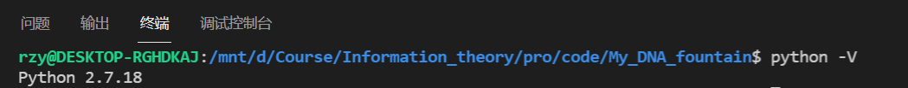
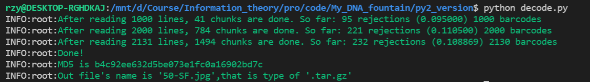
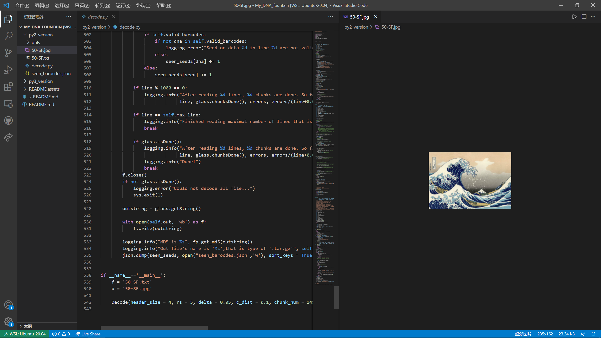
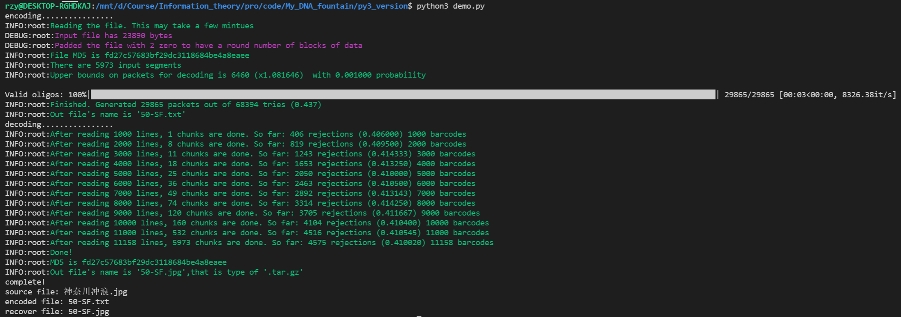
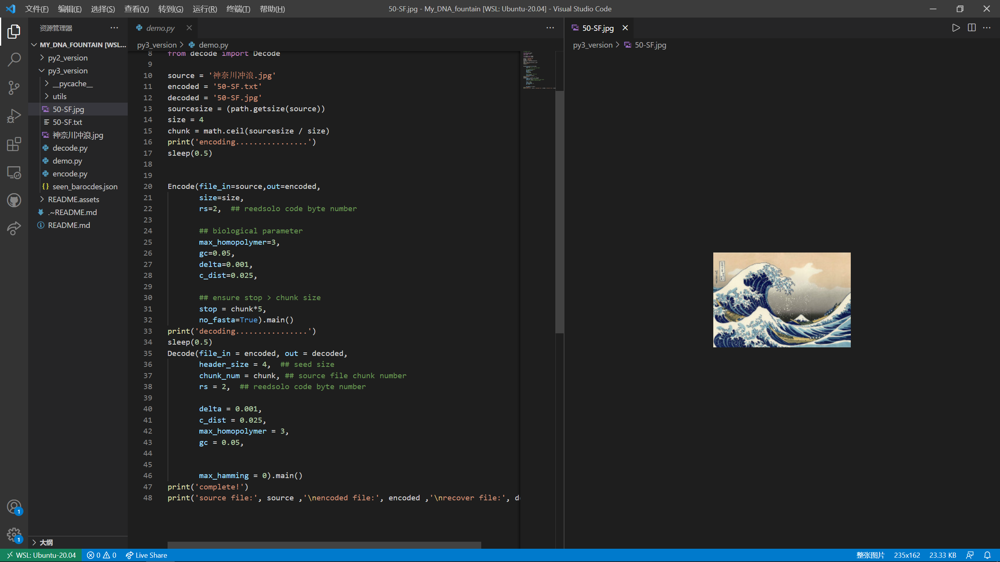

## Python2 version.

Note that in `Ubuntu`, default version for `python` is `python2`.

So in this assignment, we use `python2` to decode the provided `50-SF.txt`.

Run the `decode.py` in:  [py2_version](./py2_version).

## Python3 version

If we want to use `python3`, we need to re-encode the `神奈川冲浪.jpg` to `50-SF.txt`, and then decode it using `python3`.

Run the `demo.py` in: [py3_version](./py3_version).

